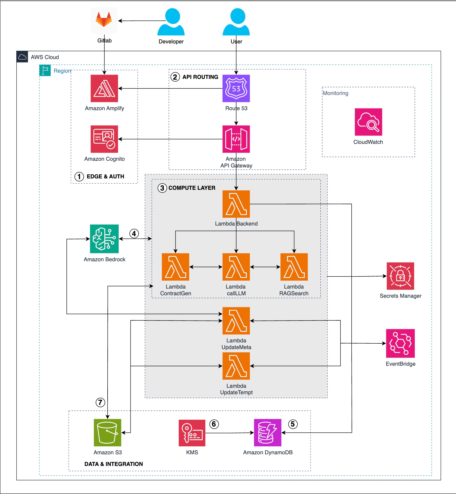

# 🤖 Smart Contract Assistant - Trợ lý Pháp lý AI trên AWS


**Smart Contract Assistant** là nền tảng AI Contract Intelligence được xây dựng trên kiến trúc **Serverless** của AWS. Ứng dụng tận dụng sức mạnh của **Generative AI (Amazon Bedrock)** và kỹ thuật **RAG (Retrieval-Augmented Generation)** để hỗ trợ người dùng không có chuyên môn sâu về pháp lý có thể rà soát, soạn thảo và tra cứu thông tin hợp đồng một cách nhanh chóng và chính xác.

## 🌟 Tính năng nổi bật

1.  **Tra cứu Pháp lý (Legal Q&A):** Hỏi đáp về các điều khoản luật dựa trên kho dữ liệu văn bản pháp luật Việt Nam.
2.  **Soạn thảo Hợp đồng (AI Drafting):** Tự động tạo bản nháp hợp đồng dựa trên các mẫu (templates) có sẵn và thông tin người dùng cung cấp.
3.  **Phân tích & Rà soát (Risk Analysis):** Tải lên file hợp đồng hoặc dán nội dung để AI tóm tắt, phát hiện rủi ro và gợi ý chỉnh sửa.
4.  **Quản lý lịch sử:** Lưu trữ lại toàn bộ các đoạn chat và hợp đồng đã tạo.

## 🏗️ Kiến trúc hệ thống

Dự án sử dụng các dịch vụ AWS cốt lõi:
*   **Frontend:** ReactJS (Vite), deploy qua AWS Amplify.
*   **Auth:** Amazon Cognito.
*   **Backend:** AWS Lambda, Amazon API Gateway (Serverless Framework).
*   **Database:** Amazon DynamoDB (Lưu User, Chat Session).
*   **Storage & Vector:** Amazon S3 (Lưu file, Vector Embeddings).
*   **AI Engine:** Amazon Bedrock (Claude 3 Haiku/Sonnet).
  

## 🎥 Demo Ứng dụng

Xem video giới thiệu chi tiết về cách hoạt động của AGREEME - Smart Contract Assistant:

[](https://www.youtube.com/watch?v=r7IIugBSSsY)

> *Bấm vào hình trên để xem video demo.*
## 🚀 Hướng dẫn Cài đặt & Triển khai (Cho Developer)

### Yêu cầu
*   Node.js & NPM.
*   Tài khoản AWS & AWS CLI đã cấu hình.
*   Serverless Framework (`npm install -g serverless`).

### Các bước triển khai
1.  **Clone Repository:**
    ```bash
    git clone https://github.com/nhatm2400/TEEJ---AGREEME.git
    cd contract-demo
    ```
2.  **Triển khai Cơ sở hạ tầng:**
    *   Tạo S3 Bucket và upload dữ liệu mẫu (`legal-corpus`, `contract-templates`).
    *   Tạo các bảng DynamoDB (`Users`, `ChatSessions`, `ChatMessages`).
3.  **Deploy Backend:**
    ```bash
    cd backend
    npm install
    npx serverless deploy
    ```
4.  **Deploy Frontend:**
    *   Đẩy code lên GitLab/GitHub.
    *   Kết nối với AWS Amplify và cấu hình biến môi trường (`VITE_API_URL`, `VITE_COGNITO_...`).

---

## 📖 Hướng dẫn Sử dụng (Cho Người dùng cuối)

Sau khi truy cập vào đường dẫn trang web (do AWS Amplify cung cấp), hãy thực hiện theo các bước sau:

### 1. Đăng ký & Đăng nhập
*   Tại màn hình chào mừng, chọn **Sign In** (Đăng nhập) hoặc **Create Account** (Tạo tài khoản).
*   Nhập Email và Mật khẩu. Hệ thống sẽ gửi mã xác nhận về email của bạn (xử lý bởi Amazon Cognito).
*   Sau khi đăng nhập thành công, bạn sẽ được đưa vào giao diện Dashboard chính.

### 2. Tính năng: Tra cứu Luật (Chatbot)
*   Chọn tab **"Tra cứu"** hoặc **"Chat"**.
*   Nhập câu hỏi của bạn vào ô chat.
    *   *Ví dụ:* "Quy định về đặt cọc trong mua bán nhà đất là gì?"
*   AI sẽ tìm kiếm trong cơ sở dữ liệu luật (RAG) và trả lời kèm theo trích dẫn điều luật cụ thể.

### 3. Tính năng: Soạn thảo Hợp đồng
*   Chọn tab **"Tạo Hợp đồng"**.
*   Chọn loại hợp đồng mẫu (ví dụ: *Hợp đồng thuê nhà*, *Hợp đồng lao động*).
*   Điền các thông tin vào Form yêu cầu (Bên A, Bên B, Giá trị, Thời hạn...).
*   Bấm **"Tạo bản nháp"**. AI sẽ sinh ra văn bản hợp đồng hoàn chỉnh. Bạn có thể tải về dưới dạng `.txt` hoặc `.docx`.

### 4. Tính năng: Phân tích Rủi ro
*   Chọn tab **"Phân tích"**.
*   **Cách 1:** Upload file hợp đồng của bạn (.pdf, .docx).
*   **Cách 2:** Copy và Paste nội dung hợp đồng vào ô văn bản.
*   Bấm **"Phân tích ngay"**. Hệ thống sẽ trả về:
    *   Tóm tắt nội dung.
    *   Mức độ rủi ro (Thấp/Trung bình/Cao).
    *   Các điểm cần lưu ý và gợi ý sửa đổi.

---

## 👥 Đội ngũ phát triển

Dự án này được thực hiện và phát triển bởi:

| Họ và Tên | Vai trò | Liên hệ/Social |
|---|---|---|
| **Trần Thị Minh Anh** | Project Lead / Frontend | https://github.com/manh-25 |
| **Nguyễn Minh Nhật** | Backend Developer / AI Engineer | https://github.com/nhatm2400 |
| **Nguyễn Trí Dũng** | AI Engineer | https://github.com/Lan0-NTD |
| **Lê Minh Tuấn** | Data Engineer / Frontend | https://github.com/YouttyLe-DSAI |


---

## ⚠️ Lưu ý quan trọng
*   Đây là dự án **Proof of Concept (PoC)** phục vụ mục đích học tập và demo công nghệ.
*   Các tư vấn từ AI chỉ mang tính chất tham khảo, **không thay thế** tư vấn pháp lý chuyên nghiệp từ luật sư.
*   Đảm bảo bạn đã tắt/xóa tài nguyên AWS sau khi trải nghiệm để tránh phát sinh chi phí không mong muốn.

## 🤝 Đóng góp
Mọi đóng góp, báo lỗi hoặc yêu cầu tính năng mới vui lòng tạo [Issue](link-to-issues) hoặc gửi [Pull Request](link-to-pr).

## 📄 License
Dự án được phân phối dưới giấy phép MIT. Xem file `LICENSE` để biết thêm chi tiết.
